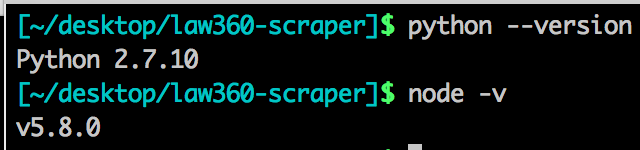
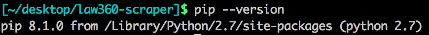

## What is this?

Hello! This is the Law360 Stan Parker case database scraper.
Written in Node.js and Python, this tool is used to collect cases by district and put the information into an excel sheet. 

The point of this program? Less wasted time copy and pasting and more time getting that money.

## Installation

So that's nice, but how do do you get this to install? Easy. You'll need to do download several things. Don't worry, you will only need to do this once:

* [Node.js](https://nodejs.org/en/download/). A server-side language written in JavaScript. Used to format the data into a readable Excel file. NPM should come with this. 

* [Python 2.7](https://www.python.org/downloads/). Another server-side language responsible for collecting the data. I recommend Python 2.7. NOTE: This step might not be necessary because most computers should come with Python. 

* [Pip](https://bootstrap.pypa.io/get-pip.py), a Python package manager. Download the file onto your desktop. We will come back to this later.

* This repository. You can do that by clicking on download zip file on [GitHub](https://github.com/chrisalcantara/law360-scraper). Drag the zip file to the desktop and extract. 

Once you everything installed, let's find out if they are working. 

On Windows, look for the command prompt and open it. You should see a window that looks like this:

In the command line type :

`python --version` 2.7.10

`node -v`

You should get something like this:

Next, let's install Pip, the Python package manager mentioned above. 

In the command line, type `cd Desktop` to take you to the desktop. To make sure you did it correctly, simply type `cwd` for the "current working directory."

Now, type `python get-pip.py`. This should install Pip for you. To make sure it works type `pip --version`. 

Let's move into the program folder: Type `cd law360-scraper`. Now you're ready to install some modules.

Node should come with `npm` – also known as the node package manager – which is responsible for downloading little tools used in Node-powered scripts. Type `npm -v` into the command line. If it returns a version number, you're good to go.

Final step: We will now install the necessary modules needed to run this program. You will run two commands:

`sudo pip install -r requirements.txt`

`npm install`

Give it a few minutes to run.
 

You'll see some activity in the command prompt. Don't worry, it's just Python and Node installing the necessary packages. 

If nothing broke – the command prompt flagging an error message – and everything installed correctly, you should be all set! Hard part is over.

## Running the script

Now that everything installed, it's time to run this thing. 

In the command line, type `cwd` – or `pwd` if you're on a Mac - to make sure you're in law360-scraper. If you are, type `make run`. The command prompt will then ask you to input a month, day and year for the script to find the necessary information. 

You will need to do this each time you run the script if you're looking for a specific day. Also, the script WILL overwrite the previously downloaded Excel file, so make sure to take it out of the folder. 

Once the program finishes running, you should see a new Excel sheet – `district_cases.csv` – in the folder. That's it!

